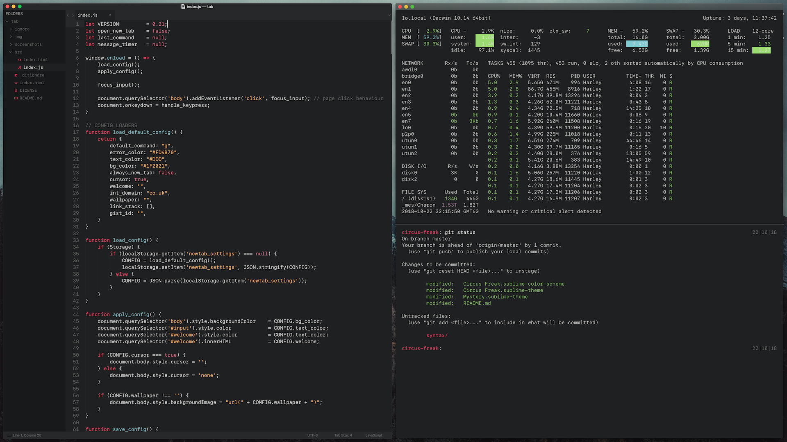
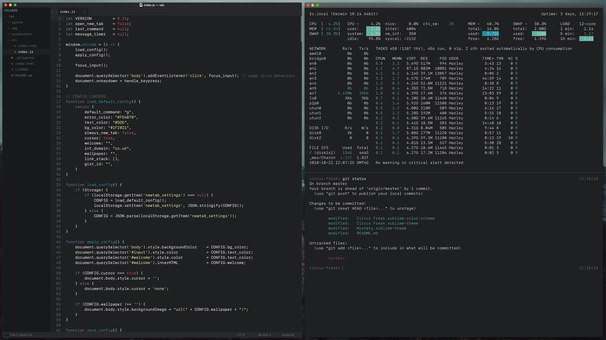

# Circus Freak Collective
A clean, dark theme collection for Sublime Text and iTerm

##### CIRCUS FREAK


##### MYSTERY


The font used in all screenshots is San Francisco Mono.

## MANIFESTO
Circus Freak was created with Fountain, Python and Lua in mind.  It supports [Fountainhead](https://packagecontrol.io/packages/Fountainhead) and my own rival [August](https://github.com/qxoko/August) package.

Originally a single theme, Circus Freak has now been turned into a collection.

## INSTALLATION & SETTINGS
Package Control coming soon!

#### SUBLIME
+ Download the [latest Sublime release](https://github.com/qxoko/CircusFreak/releases).
+ Unzip and rename the folder to `Circus Freak`.
+ Move folder inside the Packages directory: `Preferences > Browse packages...`
+ Search for `Circus Freak: Set Theme` in the command palette to preview and set the themes.
+ Alternatively, you can paste the two lines below into your User Preferences (replace `Mystery` with your chosen theme):

```json
{
	"color_scheme": "Packages/Circus Freak/Mystery.sublime-color-scheme",
	"theme": "Circus Dark.sublime-theme",
}
```

#### ITERM
+ Download the [latest iTerm release](https://github.com/qxoko/CircusFreak/releases).
+ Unzip the file.
+ Navigate to `Preferences` > `Profiles` > `Colors`
+ In the bottom-right, select the `Color Presets` dropdown.
+ Use the `Import...` button, select the chosen theme and confirm.
+ Re-open the `Color Presets` dropdown to find the imported selection in the list.

## CUSTOMISATION
#### FONT SETTINGS OVERRIDE
Paste the following into a file named `Circus Dark.sublime-theme`, and save it to your `User` directory.  This is the setting used in the screenshots above to apply San Francisco Mono to the entire UI.  You can also manipulate the tab height.  This list of settings is not exhaustive.  You can consult the theming documentation for Sublime Text 3 to change other single settings.

```json
[
	{
		"class": "tab_label",
		"font.face": "SF Mono Light",
		"font.size": 13,
	},
	{
		"class": "tabset_control",
		"tab_height": 34
	},
	{
		"class": "sidebar_heading",
		"font.face": "SF Mono Light",
		"font.size": 13,
	},
	{
		"class": "sidebar_label",
		"font.face": "SF Mono Light",
		"font.size": 13,
	},
	{
		"class": "quick_panel_label",
		"font.face": "SF Mono Light",
		"font.size": 13,
	},
	{
		"class": "quick_panel_path_label",
		"font.face": "SF Mono Light",
		"font.size": 11,
	},
	{
		"class": "quick_panel_score_label",
		"font.face": "SF Mono Light",
	},
	{
		"class": "label_control",
		"font.face": "SF Mono Light",
	}
]
```

## CREDITATION
Circus Freak's icons are (mostly) from [amCoder](https://packagecontrol.io/packages/Theme%20-%20amCoder).