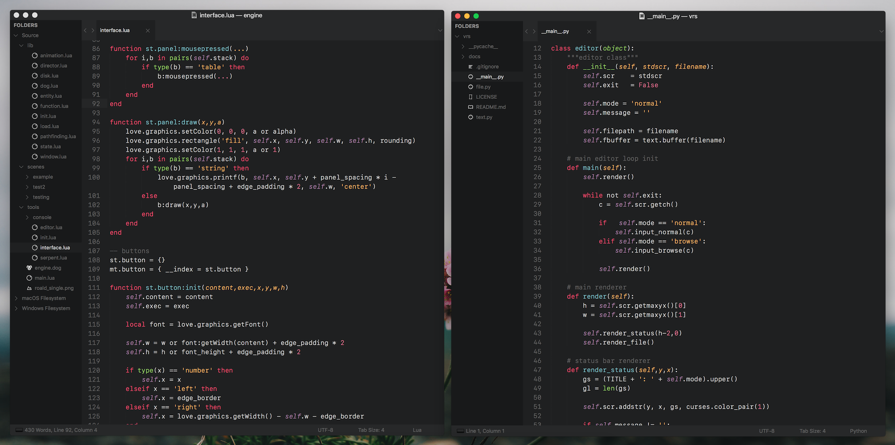

# Circus Freak
📖 A clean, dark theme for Sublime Text and iTerm



The screenshot font is SF Mono.

###### FOCUS
Circus Freak was created with Python, Lua, Markdown and Fountain in mind.  It also has specific JSON highlighting for reading ```.sublime``` configuration files.

Circus Freak will soon have specific highlighting for HTML, CSS, Javascript and the C family.

###### INSTALLATION & SETTINGS
Package Control coming soon!

+ Download the [latest release](https://github.com/thehfd/circus-freak/releases)
+ Unzip and rename folder to Circus Freak.
+ Move folder inside the Packages directory: ```Preferences > Browse packages...```

```json
{
	"color_scheme": "Packages/Circus Freak/Circus Freak.sublime-color-scheme",
	"theme": "Circus Freak.sublime-theme",

	"circus_accent_red": false,
	"circus_accent_yellow": false,
	"circus_accent_blue": false,
	"circus_accent_purple": false,
	"circus_accent_pink": false
}
```
Simply set one of the ```circus_accent``` values to ```true```.  This will recolour the interface buttons, as well as the sidebar file icons.

If no accent color is specified, the icons will default to grey with occasional red accenting.

###### CREDITATION
Circus Freak's UI theme is a modified [amCoder](https://packagecontrol.io/packages/Theme%20-%20amCoder).

~~Circus Freak's colour scheme is a modified [Centurion Galea](https://packagecontrol.io/packages/Theme%20-%20Centurion).~~

Circus Freak's colour scheme is now a ground-up rebuild in the new ```sublime-color-scheme``` format.  The original ```tmTheme``` version is not available in this repository.